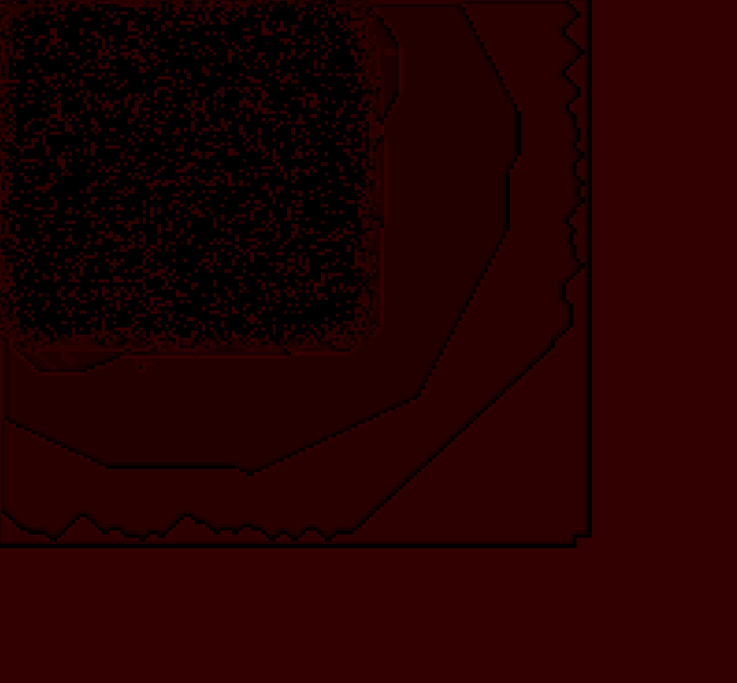

# Cellular Automatons C#

GUI implementation of cellular automatons.

After removal reading of Bitmap and moving to int matrixes, the project got really optimized, stepping 100.

Refactored UI with removal of "ScaledBitmap", allowed me to make scalable UI optimized and display 1000x1000 without much lags, and at least calculatable (with delay 100-200 ms). Conway's life on 500x500, works fine.

